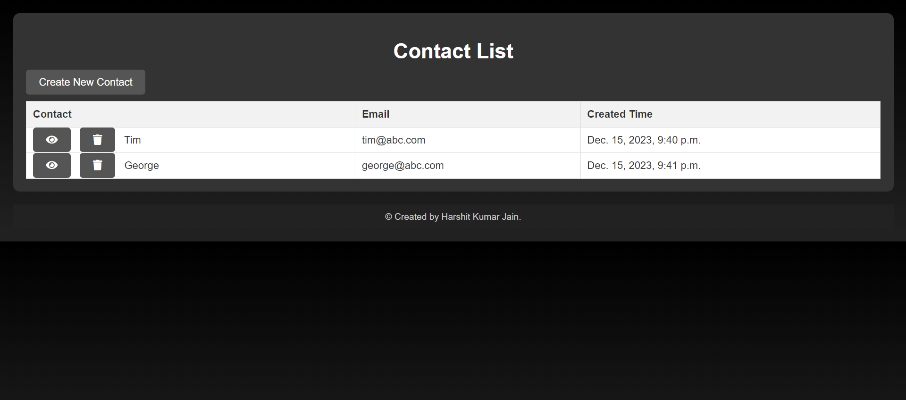

# Contact Mangement System by Harshit Kumar Jain

## A Django web application that facilitates CRUD (Create, Read, Update, Delete) operations on a contact list. Users can create new contacts, view contact details, update contact information, and delete contacts.

## Features
- Create, read, update, and delete contacts.
- Unique constraints on name and email fields.
- Validations for email format.
- Responsive and user-friendly interface.
- Clear and intuitive navigation.

## Demo

https://drive.google.com/file/d/1KFVRaCUUjxYGSuUMPD3n6o3sBbCs_LXk/view?usp=drive_link

## Implementation Screenshot

  
# Contributors
- Harshit Kumar Jain

